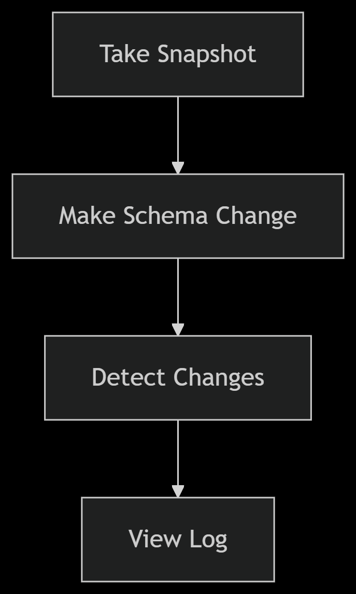
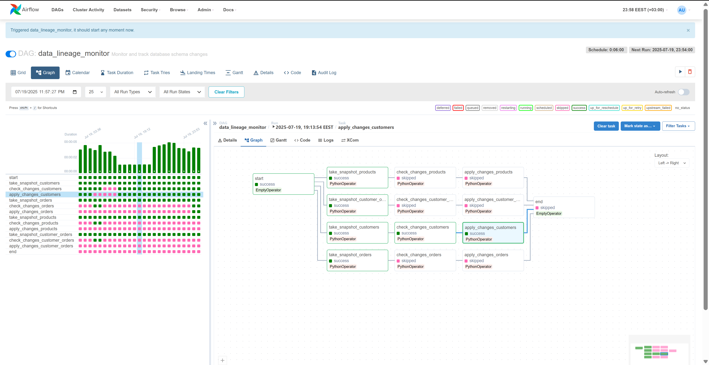

📊 Data Lineage Tracker
Track & Manage Database Schema Changes Automatically!

🚀 Built with:
✔ PostgreSQL (Store & track changes)
✔ Python (Detect & apply changes)
✔ Airflow (Schedule & automate)
✔ Docker (Continerization)

## 🌟 Key Features

- 🕵️ **Automatic Change Detection** - Track column additions, removals, and modifications
- 📜 **Complete Audit Trail** - Full history of all schema changes with timestamps
- ⚙️ **Safe Change Application** - Prevents duplicate or conflicting alterations
- 🐳 **Containerized** - Easy deployment with Docker
- 🔄 **Airflow Integration** - Scheduled checks and workflows

## 🚀 Getting Started

```bash
# Clone 
git clone https://github.com/YounisSaeed/Data-Lineage-Tracking

cd data-lineage-tracker

# environment variables
cp .env.example .env  # Edit .env to set your database and Airflow settings

# Run project
docker-compose up -d
```

```bash
## 📂 Project Structure
data-lineage-tracker/
├── dags/                        # Airflow workflows
│   └── lineage_dag.py           # Main DAG definition
├── scripts/                     # Core functionality
│   ├── db_utils.py              # Database operations
│   ├── compare_snapshots.py     # Change detection
│   └── take_snapshot.py         # Schema capture
├── docker/                      # Container configurations
│   ├── airflow/                 # Airflow service config
│   │   ├── Dockerfile
│   │   └── requirements.txt
│   └── postgres/                # PostgreSQL service config
│       └── init.sql
└── docker-compose.yml           # Service definitions
```

## HOW TO TEST

```bash
# Take initial snapshot
docker-compose exec airflow python scripts/take_snapshot.py --table customers

# Make a schema change
docker-compose exec postgres psql -U postgres -d data_catalog -c "
ALTER TABLE customers ADD COLUMN phone VARCHAR(20);"

# Detect changes
docker-compose exec airflow python scripts/compare_snapshots.py --table customers

# View results
docker-compose exec postgres psql -U postgres -d data_catalog -c "
SELECT * FROM schema_change_log ORDER BY changed_at DESC LIMIT 1;"
```

## Project Cycle 


## Airflow (Dags) 
